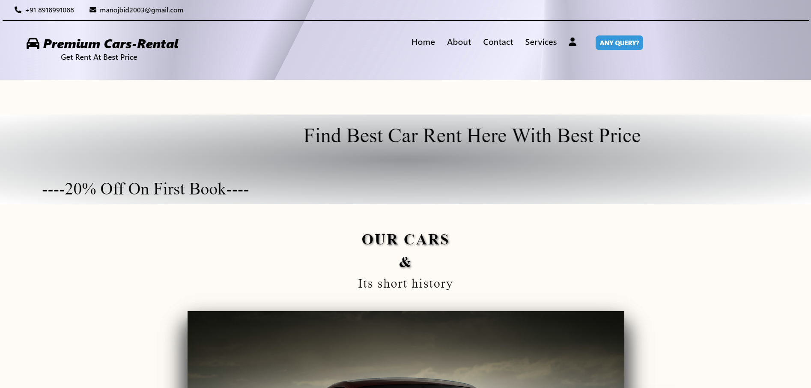

<h1 align ="center">Premium Car Rental</h1>

 <h3  align ="center"><b>Car Rental Website using HTML5,CSS3,Tailwind CSS,PHP,JAVASCRIPT,MYSQL</b></h3>
  

It is an Car Rental website which  is developed on the HTML5,CSS3,Tailwind CSS,JAVASCRIPT programming which is used for frontend and PHP is used for backend and for database connectivity. It includes various functionalities such as user Home page, About us page, Contact Page, Registration page, Login page,Reservenow Page. MySql(PhpmyAdmin) database used in this website which runs on WAMP localserver.

<ul>
 <h1><b>Programing Languages<b></h1>
<h2><b>Front-End</b></h2>
<li>HTML5</li>
 <li>CSS3</li>
 <li>Tailwind CSS</li>
 <li>JavaSCript</li>
</ul>
<ul>
<h2><b>Back-End</b></h2>
<li>PHP</li>
</ul>
<ul>
<h2><b>Database</b></h2>
<li>MySql</li>
</ul>
<ul>
<h2><b>Server</b></h2>
<li>WAMP</li>
</ul>

